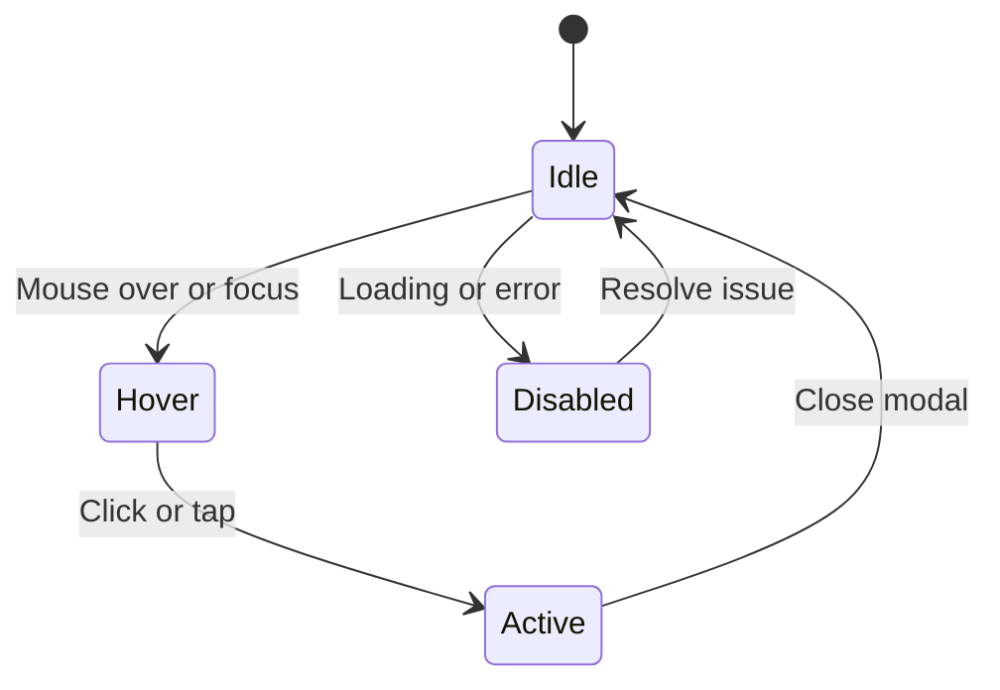

# Feature Requirements Document for Interactive Isometric Pixel Portfolio

## Table of Contents

1. [Introduction](#introduction)
2. [Functional Requirements](#functional-requirements)
3. [User Stories and Acceptance Criteria](#user-stories-and-acceptance-criteria)
4. [Interaction States and Diagrams](#interaction-states-and-diagrams)
5. [Content Structure](#content-structure)
6. [Success Metrics for Interactive Zones](#success-metrics-for-interactive-zones)
7. [Rationale and Alternative Approaches](#rationale-and-alternative-approaches)
8. [Conclusion](#conclusion)

## Introduction

The Interactive Isometric Pixel Portfolio is a web-based application designed as an immersive, game-like environment resembling an isometric pixel art office. Users can explore virtual rooms to discover professional work, projects, and personal information in an engaging, nostalgic manner. This document outlines the comprehensive feature requirements, ensuring the project meets design, technical, and user experience goals.

The portfolio includes interactive zones such as desks, windows, bookshelves, dynamic views, desk clutter, easter eggs, and ambient animations, each serving to showcase content dynamically.

Rationale: This approach differentiates the portfolio from traditional websites by providing an exploratory experience that mirrors classic video games, increasing user engagement and memorability.

Alternative Approaches:
- Standard resume website: Pros - Simple to implement, direct; Cons - Less engaging, blends with competitors.
- Video portfolio: Pros - Dynamic; Cons - Requires multimedia production, less interactive.

## Functional Requirements

1. **Navigation System**: Users can move through isometric rooms using keyboard (WASD), mouse clicks, or touch gestures on mobile.
2. **Interactive Zones**: Each zone (desk, window, bookshelf, etc.) responds to user interactions, displaying relevant portfolio content.
3. **Content Display**: Modals or overlays show project details, images, links, and descriptions in pixel art-themed UI.
4. **Dynamic Elements**: Ambient animations (e.g., flickering lights) and easter eggs enhance immersion.
5. **Responsive Design**: Adapts to desktop, tablet, and mobile, with simplified views for smaller screens.
6. **Accessibility**: Keyboard navigation, screen reader support, and high contrast options.
7. **Performance**: Smooth 60 FPS rendering, lazy loading of assets, and optimized for WebGL.
8. **Onboarding**: Tutorial for first-time users explaining controls.
9. **Error Handling**: Graceful fallbacks for loading failures or unsupported browsers.

Rationale: These requirements ensure a cohesive, accessible, and performant experience aligned with the retro game theme.

## User Stories and Acceptance Criteria

### As a Recruiter
- **User Story**: As a recruiter, I want to quickly view the candidate's projects and resume so that I can assess their fit for a role.
- **Acceptance Criteria**:
  - Desk zones display project summaries on hover.
  - Clicking a desk opens a modal with full project details, tech stack, and links.
  - Resume download available in the contact zone.
  - Time to access key info < 30 seconds.

### As a Developer Peer
- **User Story**: As a developer peer, I want to see code samples and technical details so that I can evaluate the candidate's skills.
- **Acceptance Criteria**:
  - Bookshelf zones contain code snippets and GitHub links.
  - Interactive elements reveal technical specs and challenges overcome.
  - Filtering by technology stack in project views.

### As a Casual Visitor
- **User Story**: As a casual visitor, I want to explore the office for fun and discover hidden elements so that I enjoy the experience.
- **Acceptance Criteria**:
  - Easter eggs trigger animations or fun facts.
  - Ambient animations run continuously without interaction.
  - Dynamic view changes based on time or user actions.

Rationale: User stories focus on different personas to ensure broad appeal and usability.

## Interaction States and Diagrams

Each interactive zone has defined states: Idle, Hover, Active, and Disabled.

### State Diagram for Interactive Zones



Visual Reference: The diagram shows transitions with pixel art icons (e.g., glowing sprite for Hover).

For specific zones:
- **Desk**: Idle - static sprite; Hover - glow; Active - modal popup.
- **Window**: Idle - view outside; Hover - zoom; Active - detailed scene.
- **Bookshelf**: Idle - books; Hover - highlight; Active - content reveal.
- **Dynamic View**: Changes based on user position or time.
- **Desk Clutter**: Idle - scattered items; Hover - tooltip; Active - mini-game or info.
- **Easter Eggs**: Hidden until triggered, then animate.
- **Ambient Animations**: Continuous loop, no interaction required.

Rationale: Clear states provide feedback and guide user expectations.

## Content Structure

Portfolio content is structured in JSON for easy maintenance and integration.

### Project Schema
```json
{
  "type": "object",
  "properties": {
    "id": {"type": "string"},
    "title": {"type": "string"},
    "description": {"type": "string"},
    "techStack": {"type": "array", "items": {"type": "string"}},
    "images": {"type": "array", "items": {"type": "string", "format": "uri"}},
    "links": {
      "type": "object",
      "properties": {
        "demo": {"type": "string", "format": "uri"},
        "code": {"type": "string", "format": "uri"}
      }
    },
    "date": {"type": "string", "format": "date"}
  },
  "required": ["id", "title", "description"]
}
```

### Bio Schema
```json
{
  "type": "object",
  "properties": {
    "name": {"type": "string"},
    "summary": {"type": "string"},
    "skills": {"type": "array", "items": {"type": "string"}},
    "experience": {"type": "array", "items": {"$ref": "#/definitions/experienceItem"}}
  }
}
```

Rationale: JSON schemas ensure data consistency and type safety.

## Success Metrics for Interactive Zones

Metrics measured via analytics (e.g., Google Analytics) and custom events.

- **Desk**: Click-through rate (CTR) > 70%, average time spent in modal > 45 seconds.
- **Window**: View duration > 20 seconds, zoom interactions > 50% of visits.
- **Bookshelf**: Content reveals > 60%, link clicks > 30%.
- **Dynamic View**: User-initiated changes > 40%, positive feedback in surveys.
- **Desk Clutter**: Interactions > 25%, mini-game completions > 10%.
- **Easter Eggs**: Discovery rate > 15%, social shares > 5%.
- **Ambient Animations**: Perceived engagement via heatmaps, no negative performance impact.

Rationale: Metrics quantify user engagement and guide optimizations.

## Rationale and Alternative Approaches

Throughout the document, rationales are provided for choices like pixel art for nostalgia and Three.js for 3D rendering.

Alternative Approaches:
- 2D flat design: Pros - Easier implementation; Cons - Less immersive.
- Real-time multiplayer: Pros - Social; Cons - Complexity, not needed for portfolio.

## Conclusion

This document provides a detailed blueprint for the Interactive Isometric Pixel Portfolio, covering all required aspects. Implementation should follow these requirements to deliver an engaging, professional showcase.

No open questions; all sections are defined based on existing context.